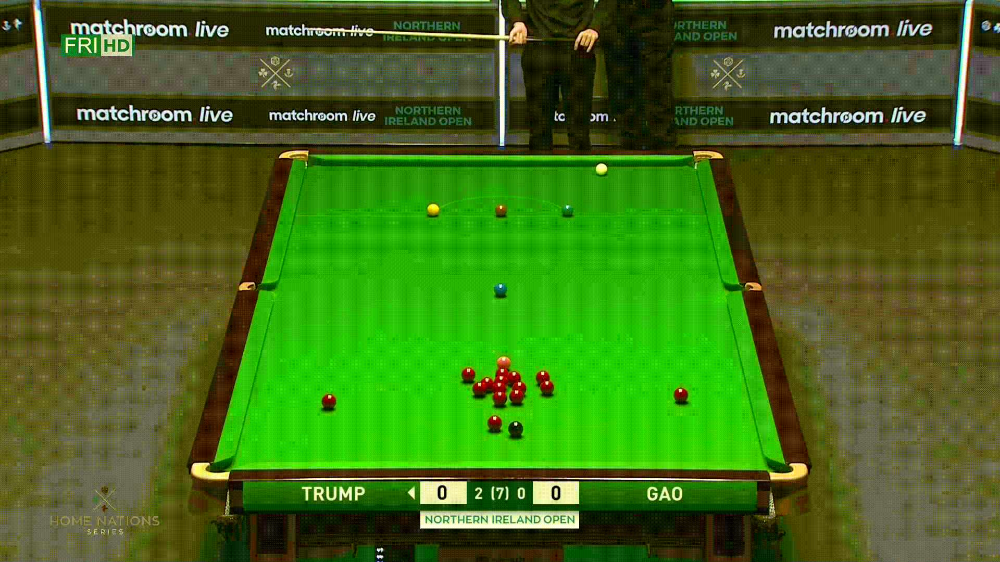

# RuiBot Chapeu

RuiBot is an autonomous snooker referee. Using video frames from a static camera RuiBot should be able to: Automatically compute an homography such that it ignores everyghing that is not the table, detect and track the snooker balls and their collisions, check which balls were potted, score plays and detect fouls.

## Progress

- [x] [Automatic Homography](#homography)
- [x] Ball Detection
- [x] Ball Tracking
- [x] [Collision Detection](#collision)
- [x] [Color Detection](#color-detection)
- [x] [Color Labeling](#color-detection)
- [ ] Pot Detection
- [ ] Score Pots
- [ ] Detect Fouls

## Results

### Homography

### Collision

    

### Color Detection

    

